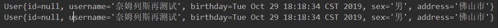

# @selectKey

关于insert()有一种需求很常见：如何确定插入数据的主键。对于MySQL中的自增类型主键，无需提供主键可以直接插入。还是以insert()函数为例，这个SQL语句没有提供主键，主键是自增类型可以自动生成。

```
@Insert("insert into user(name,age) value(#{name},#{age})")
int insert(@Param("name") String name, @Param("age") int age);
```

下面介绍一个重要注解`@SelctKey(statement="SQL语句",keyProperty="将SQL语句查询结果存放到keyProperty中去",before="true表示先查询再插入，false反之",resultType=int.class)`
其中：

- statement是要运行的SQL语句，它的返回值通过resultType来指定

- before表示查询语句statement运行的时机

- keyProperty表示查询结果赋值给代码中的哪个对象，keyColumn表示将查询结果赋值给数据库表中哪一列

- **keyProperty和keyColumn都不是必需的，有没有都可以**

- before=true，插入之前进行查询，可以将查询结果赋给keyProperty和keyColumn，赋给keyColumn相当于更改数据库

- befaore=false，先插入，再查询，这时只能将结果赋给keyProperty

- 赋值给keyProperty用来“读”数据库，赋值给keyColumn用来写数据库

- selectKey的两大作用：1、生成主键；2、获取刚刚插入数据的主键。

- 使用selectKey，并且使用MySQL的last_insert_id()函数时，before必为false，也就是说必须先插入然后执行last_insert_id()才能获得刚刚插入数据的ID。

  

#### 案例 根据maybatis CURD中的insert编写

UserDao接口

```java
@Insert("insert into user(username,birthday,sex,address) values(#{username},#{birthday},#{sex},#{address})")
    @SelectKey(statement = "select last_insert_id()",before = false,resultType =int.class)
    void insertUser(User user);
```


**没有添加@selectKey**



**添加之后**


