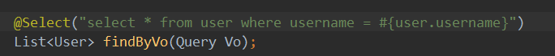

​															UserDao接口

Query.java

```java
package com.thp.domain;

public class Query {
    public User getUser() {
        return user;
    }

    public void setUser(User user) {
        this.user = user;
    }

    private User user;
}

```

测试

```java
@Test
    public void testFindByVo(){
        Query vo = new Query();
        User user = new User();

        user.setUsername("奈姆列斯");
        vo.setUser(user);

        List<User> users = userDao.findByVo(vo);

        for(User user1: users){
            System.out.println(user1);
        }
    }
```

